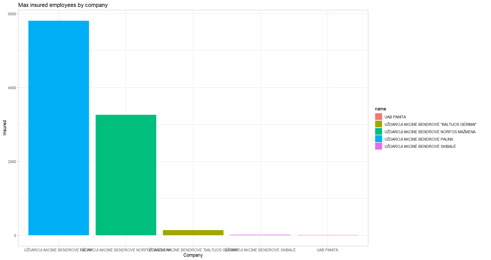

# R Laboratorinis darbas: duomenų vizualizacija

| Variantas | ecoActCode |
|------------- | ------------- |
|11   | 471100 |

### 1. Užduotis

Atsakymas:

Išvados: vidutinio atlyginimo kitimo dinamika yra standartinė, t.y. didėja atlyginimas <=> mažėja dažnis. 

### 2. Užduotis

Atsakymas: 

Išvados: TOP 5 įmonės smarkiai skiriasi vidutinio atlyginimo atžvilgiu. Kertasi tik "UAB NORFOS MAŽMENA" ir "UAB PALINK" (tik 2021-06 duomenimis).

### 3. Užduotis

Atsakymas:

Išvados:TOP 5 įmonės taip pat stipriai skiriasi apdraustų darbuotojų skaičiumi, bet tai paaiškina prieš tai pastebėtas vidutinio atlyginimo skirtumas. Galimai "mažesnės" įmonės yra startuoliai arba smulkios apimties verslai, todėl atsiranda tokie kardinalūs nuokrypiai.

### 4. Užduotis

Shiny R aplikacijos nuotrauka:

